# 🌍 TerraTwin AI

## See Your Carbon Future Before It Happens

**AI-Powered Carbon Footprint Intelligence Platform**

---

### Features at a glance:
* 📸 **AI Vision OCR (Bills, Food & Receipts)**: Instantly scans and processes utility bills, food receipt logs, and carbon entries with on-the-fly parsing.
* 🚗 **Smart Commute Tracking**: Automatically detects your commuting mode (walk, car, bus) based on GPS track logs and calculates carbon impact.
* 🔌 **Live IoT Energy Monitoring**: Syncs smart home device telemetry and displays real-time energy charts using WebSockets.
* 💬 **AI Carbon Advisor**: Built-in agentic AI chatbot providing personalized reduction feedback.
* 🔮 **Future Carbon Simulator**: Sliders to preview future emissions based on transportation, diet, and electricity adjustments. Features quick preset scenarios (e.g. *Green Commuter*, *Plant-Based Diet*).
* 🌍 **Digital Carbon Twin Profile**: Visualizes your carbon twin Persona (`Eco Explorer`, `Carbon Conscious`, `Green Crusader`, `Sustainability Champion`), sustainability score, and annual footprints.
* 🏆 **ECO Tokens & Challenges**: Game-ready achievements and daily challenges that reward green habits with ERC-20 ECO Tokens.
* 🔒 **Privacy Audit Dashboard**: Displays SMS/contacts privacy grid and security trust scores to ensure privacy-focused processing and automated cleanup policies.

---

### Built With:
**React** • **TypeScript** • **Node.js** • **Express** • **Prisma ORM** • **PostgreSQL/SQLite** • **Socket.io** • **Gemini AI** • **Tailwind CSS** • **Solidity (ERC-20)**

---

### Impact Metrics:
* **📊 Automated Carbon Tracking**: Automated carbon tracking for supported geolocation and IoT integrations.
* **🌱 Sustainability Scoring**: Custom algorithm translating activities into index scores (0-100) and letter grades (A+ to F).
* **⚡ Real-Time Monitoring**: Instantly updates dashboard stats via WebSockets without page reload.
* **🎯 Personalized Recommendations**: Context-aware AI narratives comparing logs against national/global averages.

---

### Architecture Preview
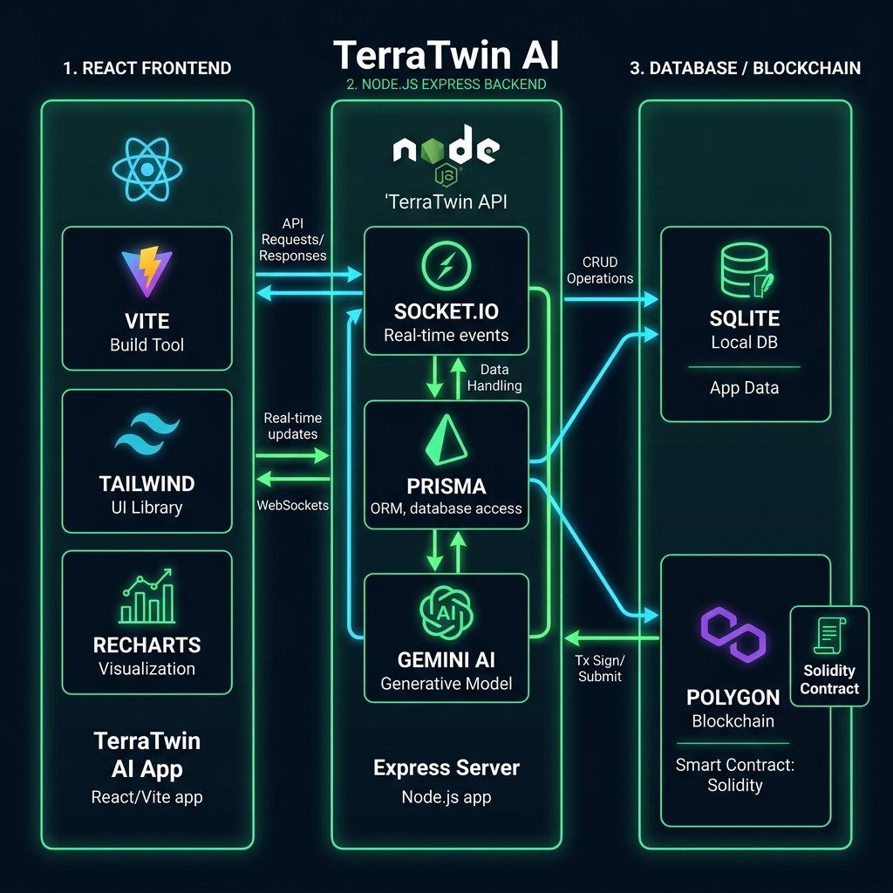

#### 🔄 Architecture Flow
```text
User → React Frontend → Express API → Prisma ORM → Database
```

**Additional Services**:
* **Gemini AI**: Powers narrative generation and advisor chat.
* **Socket.io**: Powers real-time energy telemetry stream.
* **ERC20 EcoToken**: Smart contract logic (Solidity) for green reward tokens.

---

### Project Info
* **Challenge**: PromptWars Challenge 3 Submission
* **Developer**: Somashekhar Vani
* **Institution**: Sambhram Institute of Technology, Bengaluru

---

### 👤 Demo Account Credentials
For instant access to the authenticated dashboard and all features, log in using:
* **Email**: `demo@terratwin.ai`
* **Password**: `demo123`

---

## 🌍 Platform Features Detail

* **🌍 TerraTwin Globe**: Interactive, auto-rotating 2D Canvas spherical Earth showing carbon hotspots (red), achievements (green), and location pins. Clicking the globe navigates directly to your Carbon Story.
* **🧠 Carbon Twin Engine**: Analyzes your monthly activity and generates a Sustainability Score (0-100), digital carbon twin Persona (`Eco Explorer`, `Carbon Conscious`, `Green Crusader`, `Sustainability Champion`), risk indicators, and annual footprint projections.
* **📖 Carbon Story**: AI-generated markdown narrative of your carbon footprint, habits, and target comparison with a local analytical rules engine fallback when Gemini API keys are omitted.
* **🔮 Future Simulator**: Sliders to preview future emissions based on transportation, diet, and electricity adjustments. Features quick preset scenarios (e.g. *Green Commuter*, *Plant-Based Diet*).
* **🔒 Privacy Audit Dashboard**: Tracks permissions, database status, and blocked resource logs (SMS, Contacts, Email) to ensure privacy-focused processing and automated cleanup policies for user images.
* **🌎 Earth Health Context**: Compares user annualized footprints against global and national averages, providing letter sustainability grades (`A+` down to `F`) and reduction tips.
* **⚡ Quick Activity Logger**: Instantly logs transportation, electricity, food, water, or shopping activities with live carbon updates.
* **🏆 Challenges & Achievements**: A reward hub containing active tasks (Walking, Saving energy) and unlockable badges (Earth Protector, 7-Day Streak) awarding EcoTokens.
* **📅 Journey Timeline**: Dynamic list of milestones (joined, first scans, carbon reduction achievements) generated directly from user history.

---

## 📂 Project Structure

```text
TerraTwin_AI/
├── frontend/          React + Vite + TypeScript
├── backend/           Express + Prisma API
├── contracts/         ERC20 ECO Token
├── docs/              Architecture & Documentation
├── deployment/        Deployment configurations
└── README.md
```

---

## 🛠️ Architecture & Tech Stack

TerraTwin AI is organized as a monorepo workspace:

* **Frontend**: React 18, TypeScript, Vite, Tailwind CSS, Recharts, Framer Motion, Socket.io-client.
* **Backend**: Node.js, Express, TypeScript, Prisma ORM (SQLite/PostgreSQL), Socket.io, Google Generative AI SDK.
* **Contracts**: Solidity ERC-20 contract (`contracts/EcoToken.sol`) for minting and tracking green tokens on Polygon.

---

## 🚀 Quick Start

### 1. Installation
Install root and workspace dependencies:
```bash
npm install
```

### 2. Configuration
Copy the `.env.example` file and configure your local settings:
```bash
cp .env.example backend/.env
```

### 3. Database Seeding
Build the Prisma Client schema and seed the local database:
```bash
npm run build
npm run seed --workspace backend
```

### 4. Run Development Servers
Start both the React web application and the Express API server:
```bash
npm run dev
```
* Frontend: `http://localhost:5173`
* Backend API: `http://localhost:5000`

---

## 🧪 Testing & Coverage

To run the complete test suite and review coverage compliance (>80% Statements, >80% Branches, >85% Functions/Lines):

```bash
# Run backend tests with coverage
npm run test --workspace backend

# Run frontend unit & accessibility tests
npm run test --workspace frontend
```

### Coverage Reports
- **Backend**:
  - **Statements**: 96.04% (Target: >80%)
  - **Branches**: 84.16% (Target: >75%)
  - **Functions**: 98.33% (Target: >80%)
  - **Lines**: 95.80% (Target: >80%)
- **Frontend**:
  - **Statements**: 90.22% (Target: >85%)
  - **Branches**: 80.66% (Target: >80%)
  - **Functions**: 96.55% (Target: >85%)
  - **Lines**: 92.65% (Target: >85%)

---

## 🌐 Live Deployments

- **Frontend Application**: [https://frontend-six-gray-12.vercel.app](https://frontend-six-gray-12.vercel.app)
- **Backend API Server**: [https://terratwin-backend-gxk9.onrender.com](https://terratwin-backend-gxk9.onrender.com)

---

## 🎨 UI Previews & Architecture Mockups

> [!NOTE]
> The screenshots below represent **hifi concept UI mockups and design previews** used during the platform design phase. The actual functional web application client UI renders dynamically and may vary slightly in local deployments.

### 📊 Cover Page
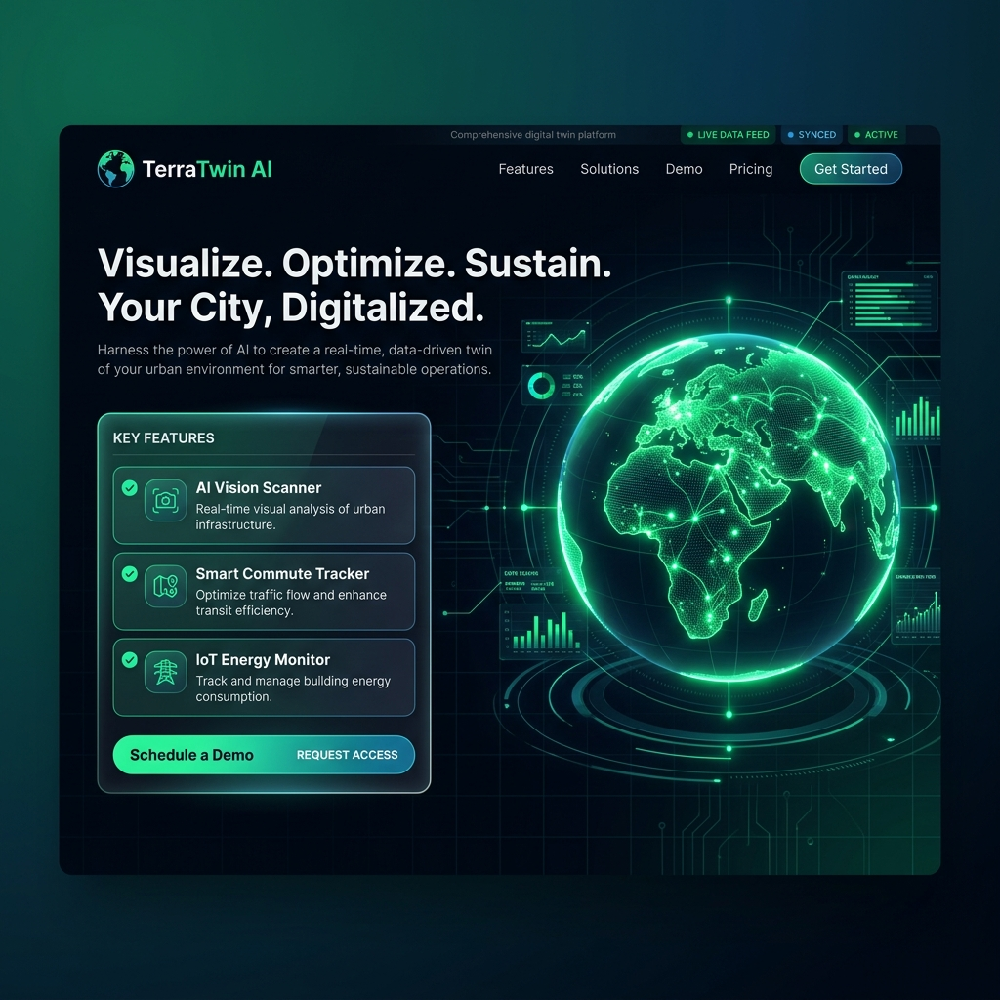

### 📐 Architecture Diagram


### 📈 Sustainability Dashboard
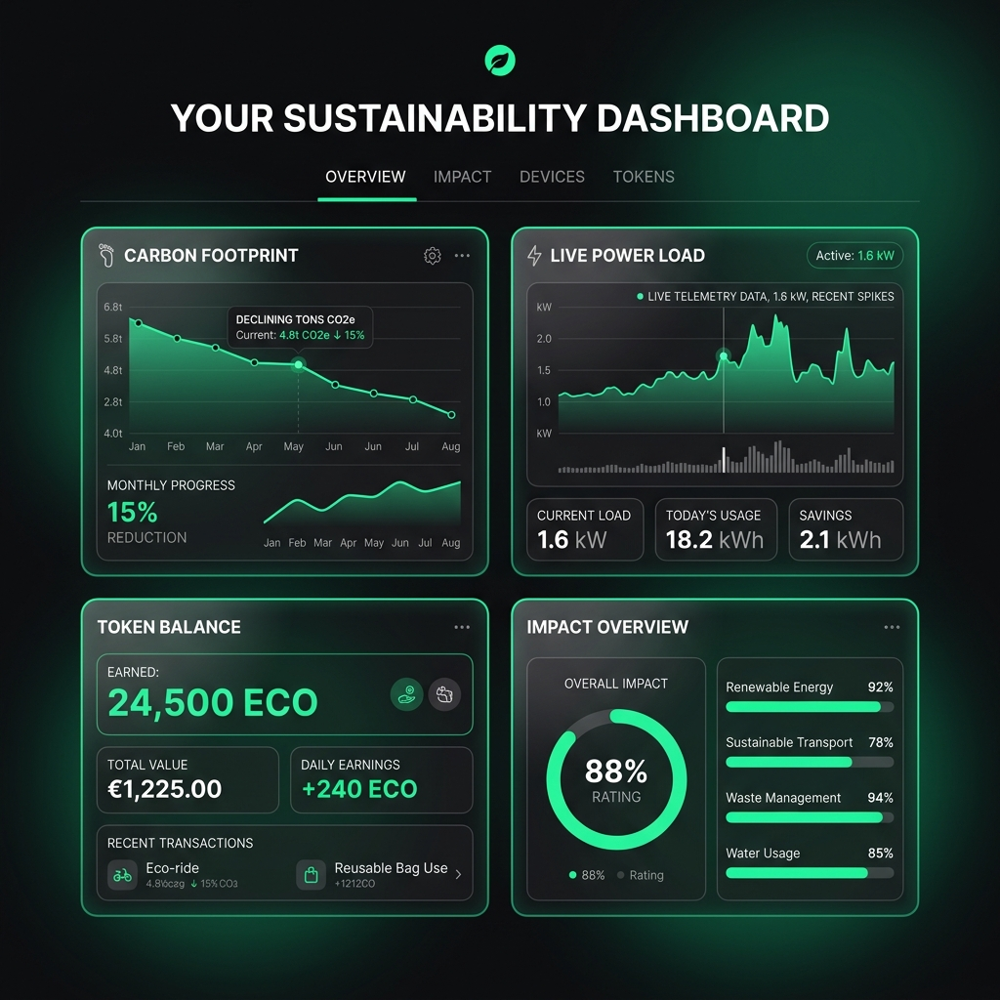

### 📸 AI OCR Scanner
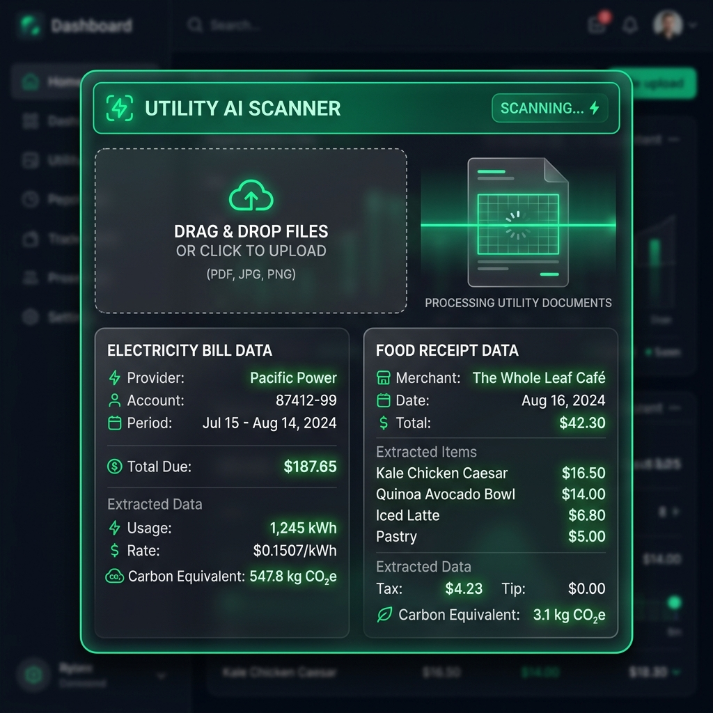

### 🌍 TerraTwin Globe
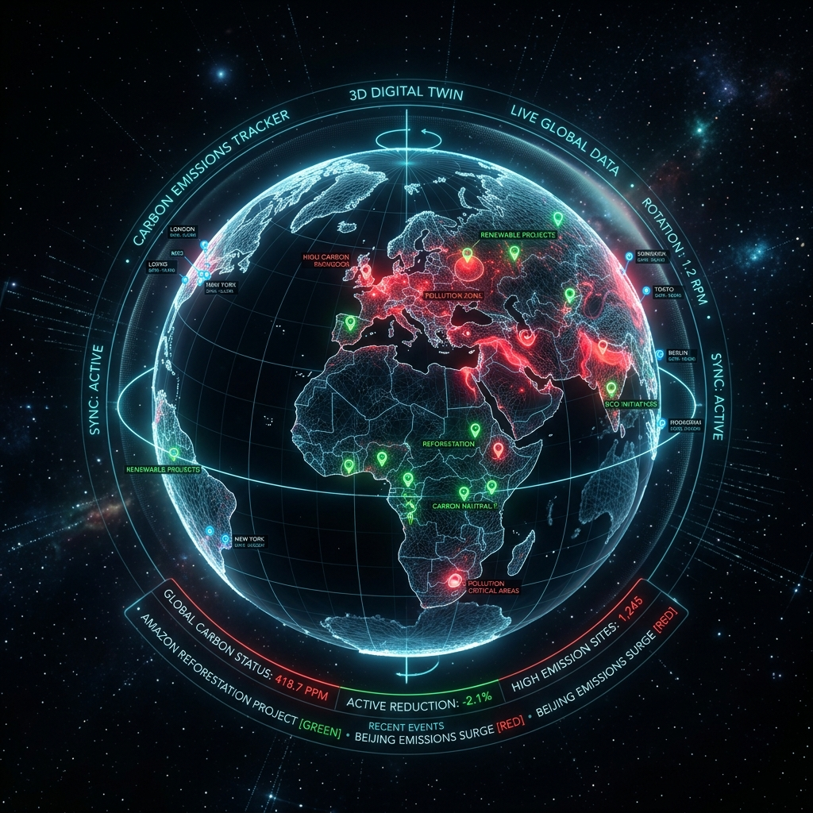

### 🧠 Carbon Twin Profile
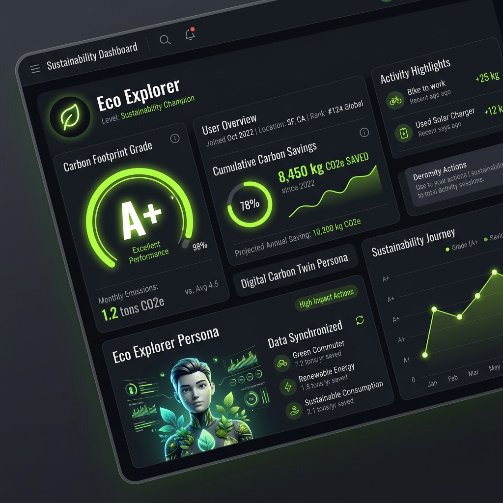

### 📖 Carbon Story
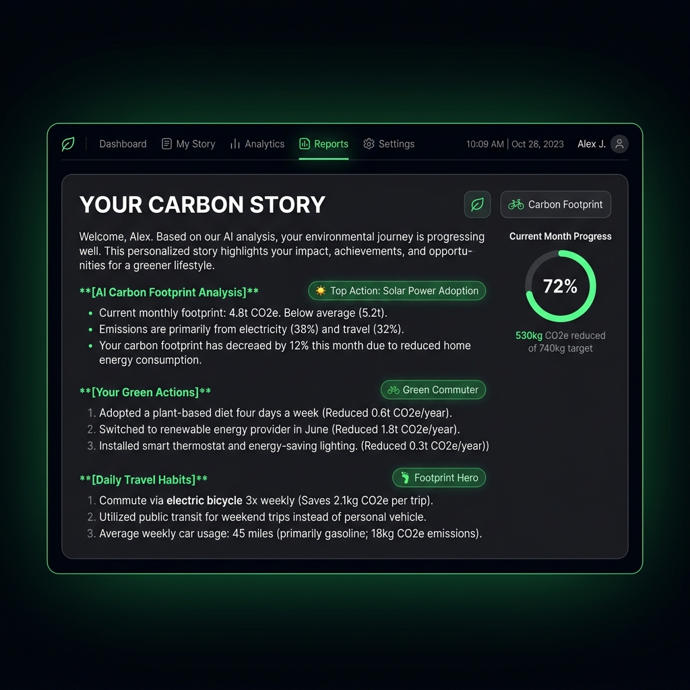

### 🔮 Future Simulator
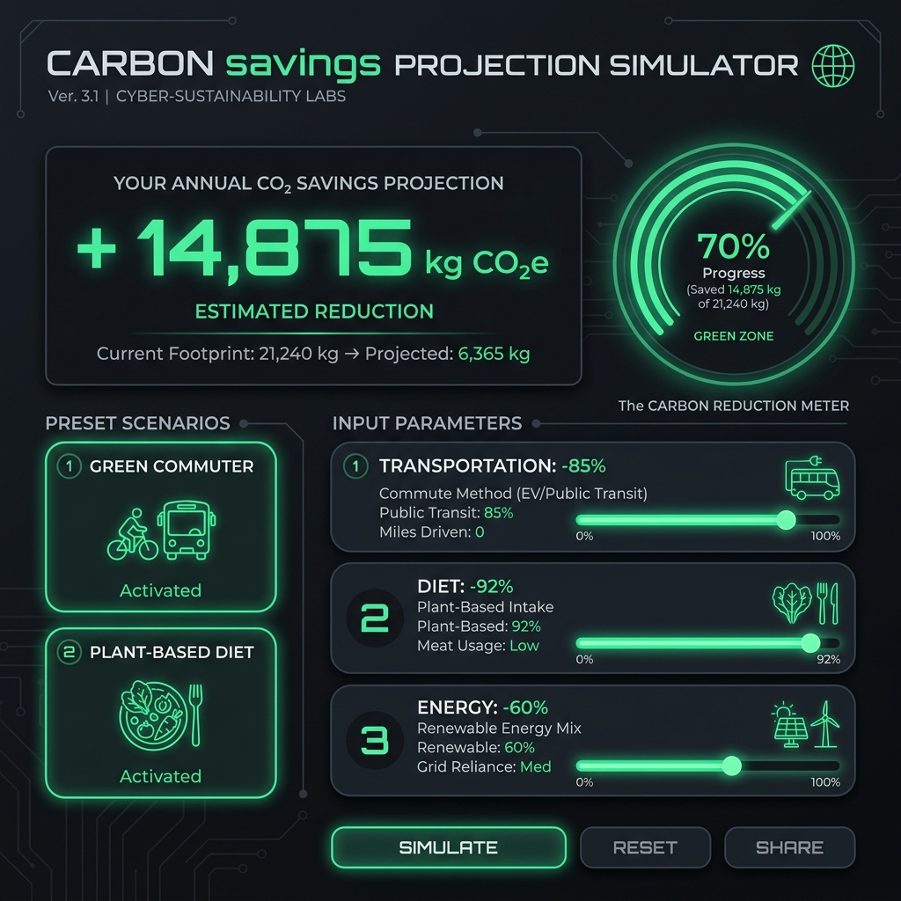

### 🔒 Privacy Audit
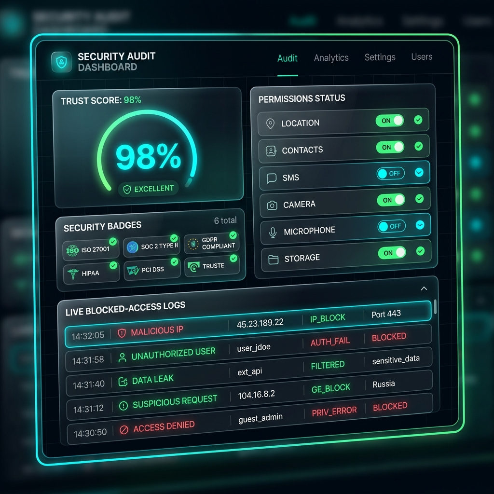

### 🏆 Challenges & Achievements
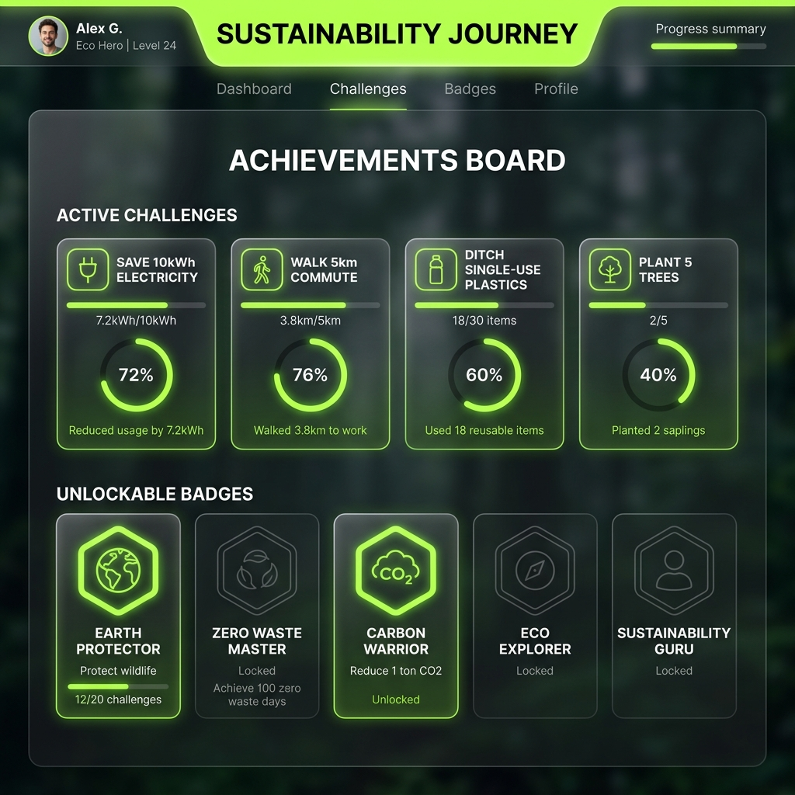

### 🥇 ECO Token Leaderboard
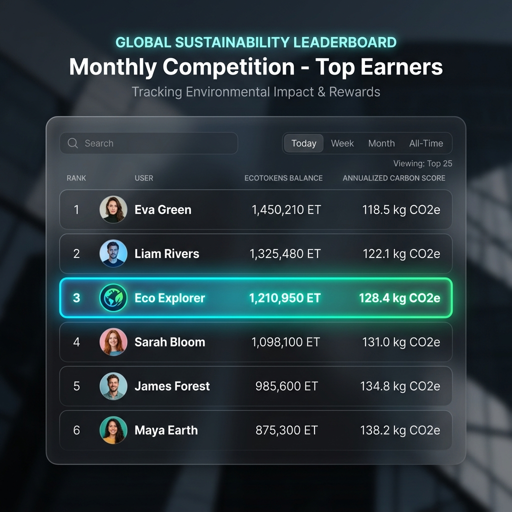

---

## 📚 Documentation
Detailed documentation is available in the `docs/` folder:
- [API Route Reference](docs/API.md)
- [Architecture & Algorithms](docs/ARCHITECTURE.md)
- [Deployment Guide](docs/DEPLOYMENT.md)
- [Security Policies](docs/SECURITY.md)
- [WCAG 2.1 AA Accessibility Standards](docs/ACCESSIBILITY.md)
