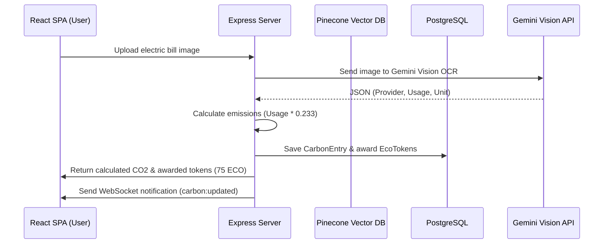

# TerraTwin AI - System Architecture

This document describes the architectural flow, component relationships, data lifecycle, and algorithms used in the TerraTwin AI platform.

---

## Technical Stack
- **Frontend**: React 18, TypeScript, Tailwind CSS, Recharts, Framer Motion, Socket.io-client.
- **Backend**: Node.js, Express, TypeScript, Prisma ORM, Socket.io, LangChain, Google Gemini API, MQTT (client via mqtt.js).
- **Storage**: PostgreSQL (Primary Relational DB), Pinecone (Vector database for Agent memory).
- **Blockchain**: Polygon EVM ERC-20 contract for EcoTokens (ECO).

---

## System Flow & Component Interactions

---

## Key Algorithms & Constants

### 1. Transportation Speed Classification
When a user transmits background GPS coordinates, the system calculates the distance from the previous coordinate using the **Haversine Formula**:

\[
d = 2r \arcsin\left(\sqrt{\sin^2\left(\frac{\Delta \phi}{2}\right) + \cos(\phi_1)\cos(\phi_2)\sin^2\left(\frac{\Delta \lambda}{2}\right)}\right)
\]

where \(\phi\) is latitude, \(\lambda\) is longitude, and \(r = 6371\text{ km}\).

The speed is computed as:
\[
\text{Speed} = \frac{\text{Distance}}{\text{Time Delta}}
\]

Based on the speed, transportation is classified:
- **Speed > 40 km/h**: Car (\(0.21\text{ kg CO}_2/\text{km}\))
- **Speed between 20 - 40 km/h**: Bike (\(0.00\text{ kg CO}_2/\text{km}\))
- **Speed between 10 - 20 km/h**: Bus (\(0.11\text{ kg CO}_2/\text{km}\))
- **Speed < 10 km/h**: Walking (\(0.00\text{ kg CO}_2/\text{km}\))

---

### 2. Live IoT Smart Meter Synchronization
Watts are accumulated over time and converted into kWh:
\[
\text{kWh} = \frac{\text{Watts} \times \text{Hours}}{1000}
\]
The carbon emitted is computed using the electricity factor:
\[
\text{Emissions} = \text{kWh} \times 0.233\text{ kg CO}_2/\text{kWh}
\]

---

### 3. Agentic AI Memory Flow
The agent integrates:
1. **Short-Term Memory**: LangChain BufferMemory.
2. **Long-Term Memory**: Pinecone vectors storing user profile preferences and past interactions.
3. **Database Records**: Aggregated user CarbonEntries fetched dynamically via SQL queries before replying to user queries about their carbon footprint.

---

### 4. Digital Carbon Twin Profile Engine
The Sustainability Score is calculated by evaluating the ratio of actual monthly emissions to the user's monthly target goal:
\[
\text{Score} = \max\left(0, \min\left(100, 100 - \left(\frac{\text{Emissions}_{\text{month}}}{\text{Goal} \times 1.5}\right) \times 100\right)\right)
\]

Based on the calculated Sustainability Score, the Digital Carbon Twin classifies the user's persona:
- **Score \(\ge\) 85**: *Sustainability Champion* (Low risk)
- **Score \(\ge\) 70**: *Green Crusader* (Low risk)
- **Score \(\ge\) 50**: *Eco Explorer* (Moderate risk)
- **Score < 50**: *Carbon Conscious* (High risk)

---

### 5. AI Carbon Storyteller Flow
The Carbon Storyteller translates raw monthly category emissions (Transport, Food, Energy) into structured Markdown insights:
1. **Gemini SDK Active**: Passes metrics context prompt to `gemini-1.5-flash` to return a conversational, actionable narrative.
2. **Offline Fallback**: Identifies the primary carbon contributor (highest category percentage) and appends customized advice templates:
   - *Transport > 40%*: Suggests substituting vehicle trips with biking/transit.
   - *Food > 40%*: Suggests lowering red meat intake and increasing plant-based foods.
   - *Energy > 40%*: Suggests lowering thermostat settings and turning off standby loads.
   - *Evenly Distributed*: Suggests minor adjustments across all categories.

